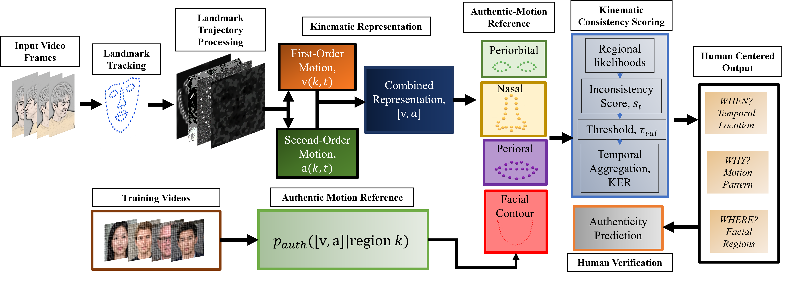

# Beyond First Order Motion: Second-Order Kinematic Deepfake Detection —



## Recommended dataset protocol

Use three datasets for the main experiment:

- **FaceForensics++ (FF++) c23**: authentic videos for training/validation of the authentic-motion model, plus the four FF++ manipulation methods for the reference test.
- **Celeb-DF v2**: independent cross-dataset/cross-generator evaluation.
- **AV-Deepfake1M**: large-scale audiovisual deepfake evaluation. Verify the exact subsets and generation methods used before analyzing or reporting results.

Keep **VoxCeleb2 optional** for a later authentic-training-diversity ablation. The cleanest primary claim is obtained when the authentic-motion distribution is estimated from FF++ authentic training data only and then evaluated on independent synthetic datasets.

No synthetic videos are used to fit the authentic-motion GMM. Synthetic labels are used only for evaluation metrics and, if needed, threshold/calibration studies that are explicitly reported as such.

### Requirements / Dependencies

You can install the required Python packages for this pipeline using `pip`:

```bash
pip install \
    "dlib>=19.24" \
    "opencv-python>=4.8" \
    "numpy>=1.24" \
    "scipy>=1.10" \
    "scikit-learn>=1.3" \
    "pandas>=2.0" \
    "tqdm>=4.65" \
    "matplotlib>=3.7"
```
```bash
python -c "import dlib, cv2, numpy, scipy, sklearn, pandas, tqdm, matplotlib; print('Environment OK')"
```
## Required Folder Structure for FFPP
```text
FFPP/
├── original_sequences/
│   └── youtube/
│       └── c23/
│           └── videos/
│
└── manipulated_sequences/
    ├── Deepfakes/
    │   └── c23/
    │       └── videos/
    ├── Face2Face/
    │   └── c23/
    │       └── videos/
    ├── FaceSwap/
    │   └── c23/
    │       └── videos/
    └── NeuralTextures/
        └── c23/
            └── videos/
```

```bash
mkdir -p landmarks/original
mkdir -p normalized/original
mkdir -p kinematics/original
mkdir -p models
mkdir -p results
mkdir -p splits
```
```bash
wget http://dlib.net/files/shape_predictor_68_face_landmarks.dat.bz2
```

## Stage 1: Extract dlib 68-point trajectories

```bash
python 01_extract_landmarks.py \
    --video_dir data/ffpp/authentic \
    --out_dir data/landmarks/ffpp_authentic \
    --predictor_path shape_predictor_68_face_landmarks.dat \
    --label real
```

Repeat for the FF++ test manipulations, Celeb-DF v2, and DeepSpeak.

## Stage 2: Normalize and smooth

```bash
python 02_normalize_smooth.py \
    --landmark_dir data/landmarks/ffpp_authentic \
    --out_dir data/normalized/ffpp_authentic \
    --smoothing_window 3
```

For the no-smoothing ablation, use `--smoothing_window 1`.

## Stage 3: Compute aligned first- and second-order kinematics

```bash
python "03_compute_kinematics.py" \
    --normalized_dir normalized/original \
    --video_dir "FFPP/original_sequences/youtube/c23/videos" \
    --out_dir kinematics/original \
    --overwrite
```

`--fps` must match the actual source frame rate. The revised script uses a centered first derivative and a centered second derivative, both defined on the same interior frames.

## Stage 4: Train region-specific authentic-motion GMMs

Create identity-disjoint authentic train/validation split files first.

```bash
python "04_train_region_gmm.py" \
    --kinematics_dir kinematics/original \
    --split_file splits/train_authentic.txt \
    --val_split_file splits/val_authentic.txt \
    --out_dir models \
    --representation second

python "04_train_region_gmm.py" \
    --kinematics_dir kinematics/original \
    --split_file splits/train_authentic.txt \
    --val_split_file splits/val_authentic.txt \
    --out_dir models \
    --representation first

python "04_train_region_gmm.py" \
    --kinematics_dir kinematics/original \
    --split_file splits/train_authentic.txt \
    --val_split_file splits/val_authentic.txt \
    --out_dir models \
    --representation combined
```

The Stage 4 fits separate GMMs for upper-face/periorbital, nasal, perioral, and contour regions. The number of mixture components is selected by BIC using authentic validation data for each region.

## Authentic-Motion Density Models

The framework models facial motion using region-specific Gaussian Mixture
Models (GMMs) trained **only on authentic FaceForensics++ videos**. Three
kinematic representations are evaluated:

- **First-order (`v`)** — facial landmark velocity.
- **Second-order (`a`)** — changes in landmark velocity across consecutive frames.
- **Combined (`[v, a]`)** — joint first- and second-order representation.

GMM complexity is selected independently for each facial region using the
lowest BIC on the held-out authentic validation set. Candidate mixture sizes
are `{2, 4, 8, 16, 32}`. Region-level negative log-likelihood scores are
clipped at the 99.9th percentile of the authentic training distribution.

| Representation | Upper-Face / Periorbital | Nasal | Perioral | Contour |
|---|---:|---:|---:|---:|
| First-order (`v`) | M=32, clip=17.1995 | M=16, clip=17.1247 | M=32, clip=18.6625 | M=16, clip=18.5237 |
| Second-order (`a`) | M=32, clip=24.1884 | M=16, clip=24.2555 | M=32, clip=25.1709 | M=16, clip=26.0161 |
| Combined (`[v,a]`) | M=32, clip=35.6293 | M=32, clip=36.3616 | TBD | TBD |

Here, `M` denotes the number of Gaussian mixture components selected by
validation BIC, and `clip` denotes the authentic-training NLL clipping
threshold used during scoring.

## Stage 5: Score each test dataset and CIs

Run all three representations on exactly the same video set.

```bash
python 05_score_and_evaluate.py \
    --kinematics_dir data/kinematics/celebdf \
    --model_path models/gmm_region_first.pkl \
    --labels_file splits/celebdf_test_labels.csv \
    --representation first \
    --p_top 25 --q_top 25 \
    --bootstrap 2000 \
    --out_csv results/first_celebdf.csv

python 05_score_and_evaluate.py \
    --kinematics_dir data/kinematics/celebdf \
    --model_path models/gmm_region_second.pkl \
    --labels_file splits/celebdf_test_labels.csv \
    --representation second \
    --p_top 25 --q_top 25 \
    --bootstrap 2000 \
    --out_csv results/second_celebdf.csv

python 05_score_and_evaluate.py \
    --kinematics_dir data/kinematics/celebdf \
    --model_path models/gmm_region_combined.pkl \
    --labels_file splits/celebdf_test_labels.csv \
    --representation combined \
    --p_top 25 --q_top 25 \
    --bootstrap 2000 \
    --out_csv results/combined_celebdf.csv
```

Repeat for FF++ and DeepSpeak.

## Stage 6: Paired representation comparison

```bash
python 06_compare_representations.py \
    --first results/first_celebdf.csv \
    --second results/second_celebdf.csv \
    --combined results/combined_celebdf.csv \
    --bootstrap 5000 \
    --out_csv results/paired_bootstrap_celebdf.csv
```

This is the key statistical analysis for the paper's central claim. It uses identical bootstrap video resamples for all representations and reports confidence intervals for differences such as:

- second-order minus first-order AUROC;
- combined minus first-order AUROC;
- combined minus second-order AUROC;
- corresponding AUPRC differences.

